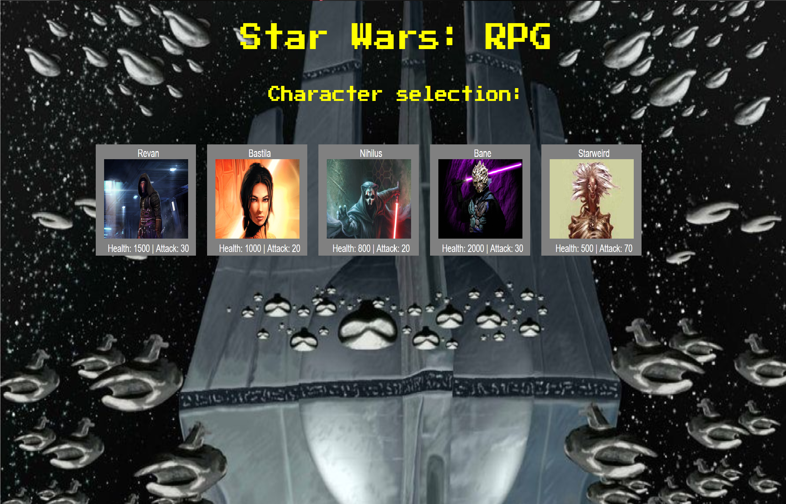

# Starwars Old Republic RPG (Extended Universe)

[click here to play](https://lardiangh.github.io/Starwars-RPG/)

## Basic rules
Choose one of the characters and fight all the others back to back on one health bar, each character has their own unique skill and strengths/weaknesses, the game restarts on defeating all the enemies or being defeated and you are able to choose another character. The game is winnable with any character, the key is to fight the enemies in the correct order for whatever character you choose.

### jQuery
jQuery is used for the majority of the appending different properties that display during the game, such as looping over each character and adding already defeated characters to an array which, when filled, ends the game. Almost everything is dynamically appended using jQuery to specific ids in the html

### Google fonts
Google fonts is used for the cool rpg style text used.
The font is called : Press Start 2P

*Code is well commented